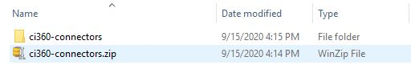

# SAS Customer Intelligence 360 - Sample Connectors

## Overview
SAS CI360 Connector Framework provides an infrastructure to integrate CI360 applications with other applications. Using the CI360 connector framework customer can connect with third party system directly using Rest API or they may need to write some connectors (example: using AWS Lambda) for massaging the input/output data received from/to the third party system.

This project contains a list of sample connector codes to help you write your connectors using AWS lambda to connect with other applications by writing programs in Python languages.

## Table of Contents

This topic contains the following sections:
* <a href="#prerequisites">Prerequisites</a>
* <a href="#installation">Installation</a>
* <a href="#getstart">Getting Started</a>
* <a href="#examples">Examples</a>
* <a href="#troubleshooting">Troubleshooting</a>
* <a href="#contributing">Contributing</a>
* <a href="#license">License</a>
* <a href="#resources">Additional Resources</a>

## Prerequisites

- Amazon Web Service account with access to Lambda and API Gateway service.

## Installation

## Getting Started

To set up and use the sample connector codes you need to perform the following steps :

### Download sample connector code
1. Download a `ci360-connectors` project source code into zip/tar.gz/tar.bz2/tar file format on your local machine. 
   `Note:` You can also clone the project on your local machine

2. The project will be downloaded on your local machine in your specified file format. You need to unzip/untar the downloaded project.  

3. You can see the folder `ci360-connectors` after unzip/untar the project.

4. Open the `ci360-connectors` folder. which will contain the `connectors` folder.

5. Navigate into the `connectors` folder which contains below-mentioned sample connector code files for connecting with Jira, MSTeams, and Slack systems.

    - **ListJiraProjects.py**: This connector is used to retrieve a list of projects from a specified Jira board. For example, this connector can be used to fetch the project's keys from the Jira board. By default this connector fetches the details from [Apache Jira Board](https://issues.apache.org/jira/secure/BrowseProjects.jspa?selectedCategory=all&selectedProjectType=software). You can configure your Jira Server by using Attributes Rest APIs or adding values like Jira-server, Jira-username, and Jira-password into this connector code.

    - **GetJiraProjectInfo.py**: This connector is used to get the details of the specified project ID from a specified Jira board. For example, this connector endpoint can be used to fetch the project details of the selected project key from the Jira board. By default this connector fetches the details from [Apache Jira Board](https://issues.apache.org/jira/secure/BrowseProjects.jspa?selectedCategory=all&selectedProjectType=software). You can configure your Jira Server by using Attributes Rest APIs or adding values like jira-server, Jira-username, and Jira-password into this connector code.

    - **PostMsgOnMSTeams.py**: Post a user comment in the configured MSTeams channel. By default, this connector will post the details on SAS MSTeams Channel. you can configure your MSTeams channel by using Attributes Rest APIs or adding msteams-url value into this connector code.

    - **PostMsgOnSlack.py**: Post a user comment in the configured Slack channel. By default, this connector will post the details on SAS Slack Channel. you can configure your Slack channel by using Attributes Rest APIs or adding slack-url value into this connector code.

    - **connector_response.py**: This is a common file use by all the above-listed connectors for error handling and creating connector response into JSON format. This file is mandatory for all the above sample connector code.

### Write an AWS Lambda Function
You need to create AWS Lambda function using a downloaded connector code. You can create multiple lambda functions for different use cases. In the example section below, I have shown below how I have configured the lambla into example section.

Please refer [How to Create a Custom Connector](http://documentation.sas.com/?cdcId=cintcdc&cdcVersion=production.a&docsetId=cintag&docsetTarget=p1jq0pbjhm7x1in18jqg7dfdmk0v.htm&locale=en#p1tnstuim2bmyin1888hwzcruad2) >> `Write an AWS Lambda Function Example` section in SAS Customer Intelligence 360 admin guide.

For more information, refer the AWS official documents - [Building Lambda functions with Python](https://docs.aws.amazon.com/lambda/latest/dg/lambda-python.html)

### Expose an AWS Lambda by using API Gateway
Once your lambda function is ready then you need to expose your lambda function using AWS API gateway. The AWS API gateway helps you to deploy your Lambda function on the server and provides REST API which will be accessible in a secure (or open) way. In the example section below, I have shown how I exposed my lambda function using the AWS API Gateway.

Please refer [How to Create a Custom Connector](http://documentation.sas.com/?cdcId=cintcdc&cdcVersion=production.a&docsetId=cintag&docsetTarget=p1jq0pbjhm7x1in18jqg7dfdmk0v.htm&locale=en#p1tnstuim2bmyin1888hwzcruad2) >> `Expose the AWS Lambda Function by Using the AWS API Gateway` section in SAS Customer Intelligence 360 admin guide.

For more information, refer the AWS official documents - [Building Lambda functions with Python](https://docs.aws.amazon.com/lambda/latest/dg/lambda-python.html)

### Register your connector into CI360

After a successful deployment of your AWS lambda on the API gateway server you should get A Rest API. You need to register the connector and endpoint with these details into the CI360 system to use the connector.

**Add and Register a Connector**
Please refer to [`Add and Register a Connector section`](http://documentation.sas.com/?cdcId=cintcdc&cdcVersion=production.a&docsetId=cintag&docsetTarget=p18n16127tbhtsn18jxoz5u1jkvl.htm&locale=en) in SAS Customer Intelligence 360 admin guide.

**Add an Endpoint**
Please refer to [`Add an Endpoint`](http://documentation.sas.com/?cdcId=cintcdc&cdcVersion=production.a&docsetId=cintag&docsetTarget=p18n16127tbhtsn18jxoz5u1jkvl.htm&locale=en) in SAS Customer Intelligence 360 admin guide.

### configure your properties by using Attributes Rest API
You can configure the attributes for your connector using Attributes Rest API. Example : If you want to connect with your Jira server than default server then you can configure properties like jira-server, Jira-username, and Jira-password using Attributes Rest API.

Please refer to [`Configure a Direct Connection to the Atlassian Jira Application`](http://documentation.sas.com/?cdcId=cintcdc&cdcVersion=production.a&docsetId=cintag&docsetTarget=n04a7swryauv51n1fqlsv972e1n3.htm&locale=en#p0a9700jl24rd5n1hjytsei3hwhr) section in the SAS Customer Intelligence 360 admin guide for configuring properties for Jira connector.

Please refer to [`Configure a Direct Connection to the Microsoft Teams Application`](http://documentation.sas.com/?cdcId=cintcdc&cdcVersion=production.a&docsetId=cintag&docsetTarget=n04a7swryauv51n1fqlsv972e1n3.htm&locale=en#p0a9700jl24rd5n1hjytsei3hwhr) section in the SAS Customer Intelligence 360 admin guide for configuring properties for MSTeams connector.

Please refer to [`Configure a Direct Connection to the Slack Application`](http://documentation.sas.com/?cdcId=cintcdc&cdcVersion=production.a&docsetId=cintag&docsetTarget=n04a7swryauv51n1fqlsv972e1n3.htm&locale=en#p0a9700jl24rd5n1hjytsei3hwhr) section in the SAS Customer Intelligence 360 admin guide for configuring properties for Slack connector.

## Examples

This example demonstrates the configuration of **ListJiraProjects** connector which is used to connect with the Jira server and fetch the project details. Also, this connector prepares the JSON response to require for the Dropdown list.

1. I have downloaded `ci360-connectors` project source code on my local machine. 
 
 This project contains sample connectors code into `connectors` folder  
 
List of sample connector files  
 

2. I have created new AWS Lambda function name as `ListJiraProjectsConnectors`. 
 
 `Note :` You can provide any name.  

3. Configure your Lambda function with sample connector code and common file. 
   I have copied the content of ListJiraProjects.py local file into the `lambda_function.py` lambda file. Also, I have created a new file with the name `connector_response.py` into lambda console and copied content from local file connector_response.py into it. 
 

4. My connector is configured for retrieving Jira project details. Now I need to expose it using API Gateway.

5. After exposing the lambda function I have got a REST API to access my lambda function.

6. I can use this REST API into CI360 to register and invoke the connector.

## Troubleshooting

## Contributing

> We welcome your contributions! Please read [CONTRIBUTING.md](CONTRIBUTING.md) for details on how to submit contributions to this project. 

## License

> This project is licensed under the [Apache 2.0 License](LICENSE).

## Additional Resources

For more information, see [External Data Integration with Connectors](http://documentation.sas.com/?cdcId=cintcdc&cdcVersion=production.a&docsetId=cintag&docsetTarget=ext-connectors-manage.htm&locale=en#p0uwf5nm4rrkn1n1gwrm03rh911r).
